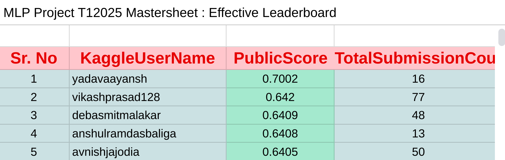
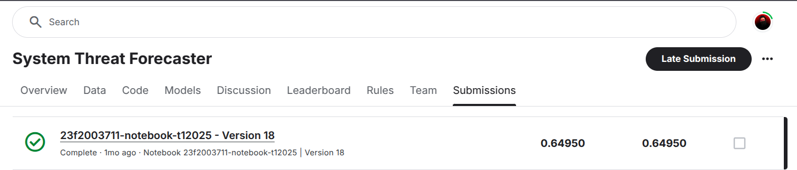

# System Threat Forecaster
A machine learning solution that predicts whether a Windows system is likely to be infected by malware, using antivirus telemetry, end-to-end feature engineering, and a multi-layer LightGBM voting ensemble — ranked **#1 out of 1700+** in the IIT Madras MLP Project (T1 2025).

## 🚀 Preview
[](https://blog.noctivagous.me/system-threat-forecaster)

<h3 align="center">
  Full Write-up:
  <br>
  <a href="https://blog.noctivagous.me/system-threat-forecaster" target="_blank"> blog.noctivagous.me/system-threat-forecaster </a>
</h3>

<div align="center">

<h3><strong>Results</strong></h3>

<table>
  <thead>
    <tr>
      <th align="left">Metric</th>
      <th align="left">Value</th>
    </tr>
  </thead>
  <tbody>
    <tr>
      <td><strong>Leaderboard Rank</strong></td>
      <td><code>#1 / 1700+</code></td>
    </tr>
    <tr>
      <td><strong>Accuracy</strong></td>
      <td><code>0.6495</code></td>
    </tr>
    <tr>
      <td><strong>Malware Recall</strong></td>
      <td><code>79%</code></td>
    </tr>
    <tr>
      <td><strong>Submissions to #1</strong></td>
      <td><code>19</code></td>
    </tr>
  </tbody>
</table>

</div>

## 💻 Built with

### Data & Analysis
- **Pandas**: Loads and wrangles the telemetry data.
- **NumPy**: Numerical operations and array handling.
- **SciPy**: Statistical tests (Chi-square) for categorical association.

### Preprocessing
- **Scikit-learn**: Pipelines, imputation, encoding, scaling, and splitting.
- **category_encoders**: Binary encoding for boolean features.

### Modeling
- **LightGBM**: The winning gradient-boosting model and ensemble base.
- **XGBoost**: Gradient-boosting benchmark.
- **Scikit-learn**: Baselines (KNN, SGD, Logistic Regression, SVM, MLP, Random Forest) and the Voting Classifier ensemble.

### Visualization
- **Matplotlib**: Plots and figures.
- **Seaborn**: Distributions, correlation heatmaps, and EDA visuals.

## 🧠 Approach

### Feature Engineering
- **DiffOS**: Weeks between the antivirus date (`DateAS`) and OS install date (`DateOS`) — machines that updated antivirus *after* the OS were far more likely to be infected. Became a top-5 predictor.
- **AppVersion**: Parsed version strings into numeric components.
- **Column Pruning**: Dropped ~16 features — `MachineID`, single-value columns, and one of each highly-correlated pair (e.g. `OSUILocaleID` ↔ `OSInstallLanguageID`, corr 0.99).

### Preprocessing Pipeline
- **Imputation**: Most-frequent strategy for the 33 sparsely-missing features.
- **Encoding**: Binary encoding for 12 boolean flags; ordinal encoding for 22 multi-class categoricals.
- **Scaling**: MinMaxScaler (0–1) for scale-sensitive models (KNN, SVM, MLP).

### Modeling & Ensemble
- Benchmarked 9 models — **LightGBM** won (val. accuracy 0.629).
- Tuned with **RandomizedSearchCV** (50 iters × 5-fold) over a 10-parameter space.
- Built 8 tuned LightGBM variants and stacked them into a **two-layer voting ensemble** (Layer 1 voting classifiers → Layer 2 hard-voting meta-classifier).
- Retrained on 100% of the data for the final submission.

## ⚙️ How to Run

### 1. Clone the Repository
```bash
git clone https://github.com/Yadav-Aayansh/System-Threat-Forecaster.git
```

### 2. Change the working directory
```bash
cd System-Threat-Forecaster
```

### 3. Create & Activate Virtual Environment
- #### Create Virtual Environment
```bash
python -m venv venv
```

- #### Activate Virtual Environment
For Linux/macOS:
```bash
source venv/bin/activate
```
For Windows:
```bash
venv\Scripts\activate
```

### 4. Install Dependencies
```bash
pip install pandas numpy scipy scikit-learn xgboost lightgbm category_encoders matplotlib seaborn jupyter
```

### 5. Launch the Notebook
```bash
jupyter notebook jupyter_notebook.ipynb
```

Run the cells top-to-bottom to reproduce the EDA, preprocessing, models, and final ensemble submission.

🌟 You are all set!
<hr>

## 📸 Screenshots




<hr>
<h3 align="center">
Thank You 🫡
</h3>
